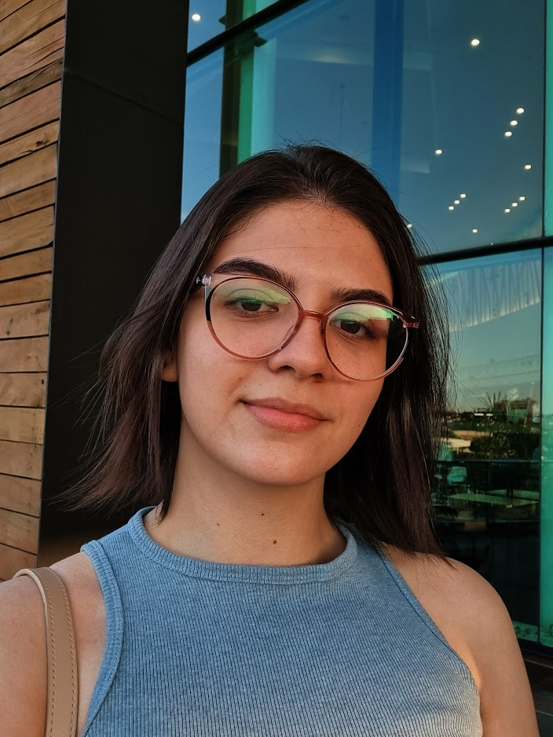

# Natural ou Fake Natty? 
> Woooow! Look at this 👀

No último desafio do Bootcamp Santander fui desafiada a produzir usando ferramentas de IA, algum tipo de material. Optei por novamente criar um e-book, visto que esse projeto teve bastante repercurssão em meu [LinkedIn](https://www.linkedin.com/in/maria-eduarda-nascimento-andrade/).
O tema dessa vez foi a questão do abuso de substâncias para práticas de bodybuilding. Essa é uma realidade presente ainda na sociedade, e que precisa de um processo de conscientização dos indivíduos.
Ainda que não seja o material mais perfeito que existe sobre o tema, fiquei satisfeita com o resultado final, uma vez que saúde e tecnologia são áreas que me chamam atenção.

## Descrição
E-book que discute pontos principais de ser `natty` ou `fake natty`. Distribuição do material deve ser gratuita e referenciar esse repositório do github no domínio do usuário @me15degrees.

## Tecnologias Utilizadas
- [ChatGPT](https://chat.openai.com/)
- [Leonardo AI](https://leonardo.ai/)

## Links Interessantes
[Vídeo do Rodrigo Goes conscientizando sobre o bodybuilding](https://www.youtube.com/watch?v=Bh6sSlLHcHs&ab_channel=RodrigoG%C3%B3es)

## 👨‍💻 Autoria

    
    
&nbsp&nbsp&nbspMaria Eduarda Nascimento Andrade 
    &nbsp&nbsp&nbsp
    <a href="https://github.com/me15degrees">
    GitHub</a>&nbsp;|&nbsp;
    <a href="https://www.linkedin.com/in/maria-eduarda-nascimento-andrade/">LinkedIn</a>
&nbsp;|&nbsp;
    <a href="https://www.instagram.com/me15degrees/">
    Instagram</a>
&nbsp;|&nbsp;
    <a href="http://lattes.cnpq.br/3152644388678173">
    Currículo Lattes</a>
&nbsp;|&nbsp;

  

